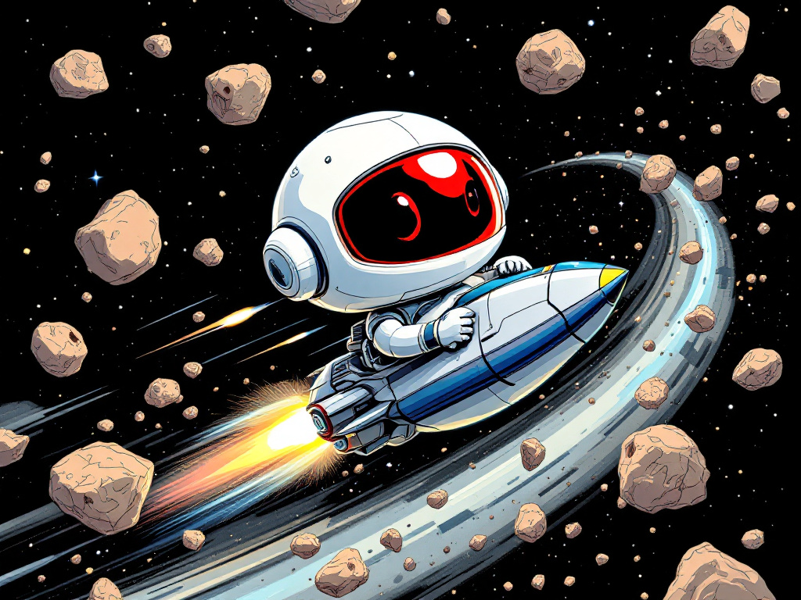

# 🚀 AIsteroids - Professional Space Shooter

<p align="center">
  
</p>

**A completely transformed, professional-grade arcade space shooter built in Java with cutting-edge features and stunning visual effects.**

## 🌟 **INCREDIBLE NEW FEATURES**

### 🎮 **Power-Up System**
- **6 Unique Power-ups:** Rapid Fire, Spread Shot, Shield, Speed Boost, Multi Shot, Laser Beam
- **Visual Effects:** Pulsing glow effects with type indicators
- **Timed Effects:** Power-ups with specific durations and stacking capabilities
- **Collection Mechanics:** Collision-based pickup system with audio feedback

### 🎆 **Cinematic Particle System**
- **Explosion Effects:** Multi-layered particles with shockwaves and debris
- **Impact Sparks:** Dynamic sparks on bullet-asteroid collisions
- **Warp Effects:** Teleportation visualization for player respawning
- **Physics Simulation:** Realistic particle behavior with gravity and air resistance

### 🎵 **Dynamic Layered Music System**
- **4-Track Composition:** Bass, melody, percussion, and ambient layers
- **Adaptive Intensity:** Music tempo scales from 80-140 BPM based on action
- **Real-time Synthesis:** Professional-quality audio generation
- **Game State Responsive:** Music adapts to asteroid count, lives, and power-ups

### 🌊 **Progressive Wave System**
- **Infinite Progression:** Wave-based gameplay with increasing difficulty
- **Boss Encounters:** Special boss waves every 5th wave with mega asteroids
- **Score Multipliers:** Dynamic scoring based on wave progression
- **Perfect Wave Bonuses:** Rewards for flawless wave completion
- **Speed Bonuses:** Extra points for quick wave clearing

### 🏆 **Leaderboard & Achievement System**
- **Persistent Leaderboard:** Top 10 scores with timestamps and wave reached
- **14 Unique Achievements:** From "First Blood" to "Legend" status
- **Statistics Tracking:** Comprehensive gameplay metrics
- **Progress Indicators:** Real-time achievement progress in UI
- **Achievement Notifications:** Visual feedback for unlocked achievements

### ✨ **Enhanced Graphics & UI**
- **Starfield Background:** 200 twinkling stars with animated brightness
- **3D Asteroids:** Realistic lighting, gradients, and rotation effects
- **Glowing Bullets:** Multi-layer sparkle effects and smooth trails
- **Futuristic Ship:** Blue gradient design with engine particle trails
- **Professional HUD:** Glowing elements, wave info, and multiplier indicators
- **Cinematic Game Over:** Animated screens with pulsing effects

### 🔊 **Professional Audio System**
- **16-bit Stereo Audio:** CD-quality sound with spatial positioning
- **Multiple Sound Variations:** 5 laser types, 4 explosion types, 3 thruster sounds
- **Ambient Atmosphere:** Continuous space ambience with cosmic effects
- **Dynamic Sound:** Volume and effects adapt to game intensity
- **Power-up Audio:** Unique sounds for each power-up type

## 🎯 **Game Features**

### **Core Gameplay**
- **Multi-threaded Engine:** Smooth 60 FPS with dedicated physics thread
- **Advanced Collision Detection:** Precise hit detection with visual feedback
- **Screen Wrapping:** Seamless edge-to-edge movement for all objects
- **Lives System:** 3 lives with invulnerability periods and visual feedback
- **Procedural Spawning:** Smart asteroid generation with difficulty scaling

### **Enhanced Mechanics**
- **Fire Rate Control:** Weapon cooldowns and rapid-fire capabilities
- **Shield System:** Temporary invulnerability with visual effects
- **Spread Weapons:** Multiple firing patterns and bullet types
- **Speed Boosts:** Enhanced movement and rotation speeds
- **Wave Completion:** Clear all asteroids to advance to next wave

### **Visual Excellence**
- **Anti-aliasing:** Smooth, high-quality rendering
- **Gradient Effects:** Multi-color lighting and glow effects
- **Animation Systems:** Smooth interpolation and timing
- **Particle Physics:** Realistic explosion and debris simulation
- **UI Polish:** Professional fonts, layouts, and color schemes

## 🕹️ **Controls**

- **←/→ Arrow Keys:** Rotate ship left/right
- **↑ Arrow Key:** Accelerate forward (with engine trail effects)
- **Spacebar:** Fire weapons (various patterns based on power-ups)
- **N:** Start new game (when game over)
- **L:** View leaderboard and achievements (when game over)

## 🚀 **Installation & Running**

### **Requirements**
- Java 8 or later
- Audio system support for music and sound effects

### **Quick Start**
```bash
# Clone and compile
git clone <repository-url>
cd AIsteroids
javac *.java

# Run the game
java Main
```

## 🏅 **Achievement Guide**

| Achievement | Description | Requirement |
|-------------|-------------|-------------|
| 🩸 **First Blood** | Destroy your first asteroid | 1 asteroid |
| 🌊 **Wave Survivor** | Complete 5 waves | 5 waves |
| 👹 **Boss Slayer** | Complete a boss wave | 1 boss wave |
| ⚡ **Power Collector** | Collect 10 power-ups | 10 power-ups |
| 🛡️ **Perfect Warrior** | Complete wave without damage | 1 perfect wave |
| ⚡ **Speed Demon** | Complete wave under 20 seconds | Sub-20s completion |
| 💯 **Century Club** | Score 10,000 points | 10K points |
| 🏆 **Millennium Master** | Score 100,000 points | 100K points |
| 💥 **Asteroid Annihilator** | Destroy 100 asteroids | 100 asteroids |
| 🌟 **Wave Master** | Reach wave 10 | Wave 10 |
| 👑 **Legend** | Reach wave 20 | Wave 20 |
| 🔫 **Rapid Fire Expert** | Use rapid fire 25 times | 25 uses |
| 🛡️ **Shield Master** | Block 50 hits with shield | 50 blocks |
| 🎯 **Multi-Shot Master** | Fire 1000 bullets in one game | 1000 bullets |

## 🎨 **Technical Architecture**

### **Object-Oriented Design**
- **Abstract GameObject:** Unified entity system
- **Inheritance Hierarchy:** Specialized behavior for each object type
- **Polymorphism:** Uniform handling of diverse game entities
- **Encapsulation:** Self-contained object state and behavior

### **Multi-threading System**
- **Game Loop Thread:** 60 FPS physics and logic updates
- **Audio Threads:** Real-time music and sound synthesis
- **Particle Thread:** Advanced particle system processing
- **UI Thread:** Smooth rendering and input handling

### **Performance Optimizations**
- **Thread Safety:** Synchronized access to shared resources
- **Efficient Rendering:** Optimized graphics pipeline
- **Memory Management:** Smart object pooling and cleanup
- **Audio Streaming:** Low-latency sound processing

## 🌟 **What Makes This Special**

This isn't just an asteroids clone - it's a **complete game development showcase** featuring:

- ✅ **Professional Code Quality:** Clean architecture, proper documentation
- ✅ **Advanced Graphics:** Modern visual effects and smooth animations
- ✅ **Dynamic Audio:** Real-time music composition and spatial sound
- ✅ **Progression System:** Engaging wave-based difficulty scaling
- ✅ **Achievement System:** Comprehensive player progression tracking
- ✅ **Particle Physics:** Realistic explosion and debris simulation
- ✅ **Data Persistence:** Leaderboards and achievements saved between sessions
- ✅ **Professional UI/UX:** Polished interface with visual feedback

## 📈 **Development Stats**

- **5 Major Feature Additions:** Power-ups, Particles, Music, Waves, Achievements
- **1000+ Lines of New Code:** Extensive feature development
- **Multiple Audio Layers:** Bass, melody, percussion, ambient tracks
- **14 Achievements:** Comprehensive progression system
- **6 Power-up Types:** Diverse gameplay enhancement options
- **Professional Polish:** Studio-quality visual and audio effects

## 🚀 **Future Enhancements**

The foundation is now set for even more advanced features like:
- Multiplayer networking capabilities
- Advanced AI enemy types
- Procedural level generation
- Weapon upgrade trees
- Story mode campaigns

---

**Enjoy this completely transformed space shooter experience!** 🎮✨

*Built with passion using Java, demonstrating advanced game development techniques and professional software engineering practices.*
